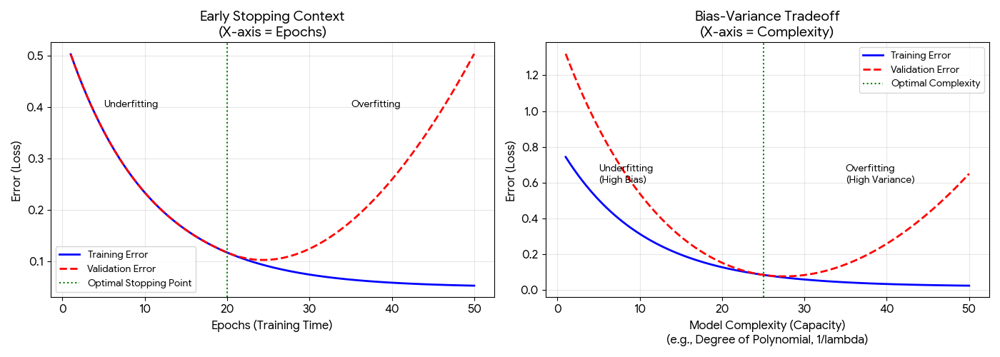

# Notes 3395

## 生成式和判别式

### 如何决定使用哪种模型？（Decision Framework）

| **决策维度** | **选 生成式 (Generative) 的情况** | **选 判别式 (Discriminative) 的情况** |
| --- | --- | --- |
| **数据量** | **数据极少时**。因为如果你的分布假设（如高斯）是对的，它收敛极快（需要的样本少）。(参考 2018 Q2.1 6) | **大数据量时**。随着数据增加，判别式模型的渐近误差 (Asymptotic Error) 通常更低，上限更高。 |
| **缺失值/噪声** | **有缺失数据时**。生成式模型可以对边缘分布 $P(X)$ 建模，更容易处理缺失特征。
对抗噪声（尤其是异常点）能力较强（Robust）数据的整体分布形状”（比如高斯分布的均值和方差）。如果数据中混入几个极端的噪声点（Outliers），它们通常离分布中心很远，概率密度 $P(X|Y)$ 很低。 | 对缺失值敏感，通常需要预处理填充。
**容易受边界噪声影响**。(Noise close to boundary)  — （如 SVM、逻辑回归）非常依赖**正则化(Regularization)** 来忽略这些边界噪声。 |
| **任务目标** | 需要**生成新样本** (Sample generation) 或做**异常检测** (Outlier Detection, 发现 $P(X)$ 很小的点)。 | 只需要**分类**或**回归**，且追求最高的预测准确率。 |
| **异常点 (Outliers)** | 容易受异常点影响（因为异常点会拉偏均值 $\mu$ 和方差 $\sigma$）。 | 相对鲁棒（如 SVM 关注支持向量，逻辑回归关注边界附近的点）。 |
| **计算复杂度** | 训练通常更快（只需计数或算均值，不需要迭代优化）。 | 训练较慢（需要多轮梯度下降）。 |
|  |  |  |

**归纳偏置 (Inductive Bias)**：

- **定义**：模型在没看数据之前，对“答案长什么样”做出的**假设**。没有 Bias 就无法学习（No Free Lunch Theorem）。
- **例子（必背）**：
    - **线性回归**的 Bias：假设数据是线性的。
    - **k-NN** 的 Bias：假设相近的点属于同一类 (Smoothness)。
    - **决策树** 的 Bias：假设决策边界是平行于坐标轴的切分。
    - **CNN** 的 Bias：假设图像具有平移不变性 (Translation Invariance)。

`**先验知识 (Prior Knowledge)**：
• **定义**：在看数据之前，我们（人类）在这个问题中塞进去的额外信息。
• **例子**：正则化（Regularization）。当我们加 L2 正则化时，我们其实是塞入了先验知识：“权重参数 $w$ 应该是比较小的”。

这就回到了 **生成式 (Joint)** vs **判别式 (Conditional)** 的核心定义。
1. **生成式模型** 建模的是 **联合分布 $P(X, Y)$**。
    ◦ 意思是我知道“全貌”。我知道 $X$ 出现的概率，也知道 $Y$ 出现的概率，以及它们同时出现的概率。
2. **判别式模型** 建模的是 **条件分布 $P(Y|X)$**。
    ◦ 意思是我只知道“给一个 $X$，它属于 $Y$ 的概率”。
证明逻辑：
根据概率论基础公式：
$$P(Y|X) = \frac{P(X, Y)}{P(X)}$$

其中，$P(X)$ 可以通过对 $P(X, Y)$ 求和（积分）得到：$P(X) = \sum_y P(X, y)$。
**结论**：
• 如果你拥有 **$P(X, Y)$** (生成式/上帝视角)，你就可以通过除法算出 **$P(Y|X)$**。**所以生成式包含了判别式所需的信息。**
• 反之，如果你只有 $P(Y|X)$ (判别式)，你**推导不出** $P(X, Y)$，因为你不知道 $P(X)$ 是多少（你不知道数据的密度分布）。
**考试怎么答**："True. Because from the joint distribution $p(x,y)$, we can compute the marginal $p(x) = \sum_y p(x,y)$, and then derive the conditional $p(y|x) = p(x,y) / p(x)$."

## Decision Tree

**1. 必背公式 (Memorize)**
1. 熵 (Entropy) - 衡量混乱程度：
对于二分类（正类 $+$，负类 $-$），集合 $S$ 的熵为：
$$H(S) = - p_+ \log_2 p_+ - p_- \log_2 p_-$$
    ◦ *注意*：规定 $0 \log_2 0 = 0$。
    ◦ *极值*：全是一类时 $H=0$（最纯）；两类各一半时 $H=1$（最乱）。
2. 信息增益 (Information Gain) - 衡量分裂的好坏：
$$IG(S, A) = H(S) - \sum_{v \in Values(A)} \frac{|S_v|}{|S|} H(S_v)$$
    ◦ 含义：(分裂前的熵) - (分裂后子集的加权平均熵)。
    ◦ **考试逻辑**：算一下按特征 A 分裂的 IG，再算按特征 B 分裂的 IG，选 IG 大的那个做根节点。

### 2. 必理解考点 (Understand & Apply)

1. **深度 (Depth) 与 偏差/方差 (2018 Final Q2.6)**：
    - **浅树 (Shallow Tree)**：高偏差 (High Bias)，欠拟合 (Underfitting)。决策边界太简单。
    - **深树 (Deep Tree)**：高方差 (High Variance)，过拟合 (Overfitting)。**必考点**：深树会把数据中的**噪声 (Noise)** 当作规律学进去，导致测试集准确率下降。
2. **决策边界 (Decision Boundary)**：
    - 决策树的边界是**正交的 (Orthogonal)**，即平行于坐标轴的切割线。它画不出斜线（除非用很多锯齿状的切分去逼近）。
3. **贪心算法 (Greedy)**：
    - 决策树构建是贪心的：每一步只看当前最好的分裂，不考虑未来。所以它不一定能找到全局最优树，但计算效率高。

### 1. 高斯最大似然估计 (Gaussian MLE) - 训练流程

对应 Lab 3

核心逻辑：训练阶段本质上就是“按类别分组，然后算均值和方差”。

Python

```python
function Train_GaussianNB(X_train, y_train):
    # 1. 初始化参数存储
    parameters = {} 
    classes = unique(y_train)  # 获取所有类别，例如 [0, 1]

    # 2. 对每个类别分别计算 (MLE 核心步骤)
    for c in classes:
        # 取出当前类别的所有样本
        X_c = X_train[y_train == c] 
        
        # A. 计算先验概率 P(Y=c)
        prior = len(X_c) / len(X_train)
        
        # B. 计算均值 (Mean) - MLE 估计 mu
        # 对每个特征维度求平均
        mu = sum(X_c) / len(X_c) 
        
        # C. 计算方差 (Variance) - MLE 估计 sigma^2
        # 对每个特征维度求方差
        sigma_sq = sum((x - mu)^2 for x in X_c) / len(X_c)
        
        # 保存该类的参数
        parameters[c] = {
            "prior": prior,
            "mu": mu,
            "sigma_sq": sigma_sq
        }
        
    return parameters
```

**考试速记要点**：

- **输入**：训练数据。
- **循环**：遍历每个类别 $c$。
- **MLE 公式**：$\mu = \text{Mean}$, $\sigma^2 = \text{Variance}$。
- **输出**：存好每个类的 $\mu, \sigma^2, \pi$ (Prior)。

---

### 2. 决策树构建 (Decision Tree Training) - 递归流程

对应 Lab 7

核心逻辑：贪心算法 (Greedy)。在每一步找一个“最好的刀”切下去，直到切不动为止。

Python

```python
function Build_Tree(data, labels, depth):
    # 1. 停止条件 (Stopping Criteria)
    # 如果达到最大深度，或数据全属于同一类 (纯度100%)
    if depth >= max_depth OR labels are all same:
        return LeafNode(prediction = MajorityClass(labels))

    # 2. 寻找最佳分割点 (Best Split) - 核心考点
    best_split = None
    max_gain = -1
    
    # 遍历所有特征和所有可能的切分值
    for feature in all_features:
        for threshold in possible_thresholds(feature):
            
            # 计算信息增益 (IG = H_parent - H_children)
            gain = Calc_Information_Gain(data, feature, threshold)
            
            if gain > max_gain:
                max_gain = gain
                best_split = (feature, threshold)

    # 3. 如果找不到有益的分割 (增益太小)
    if max_gain == 0:
         return LeafNode(prediction = MajorityClass(labels))

    # 4. 执行分割并递归 (Recursion)
    left_data, right_data = Split(data, best_split)
    
    node = Node(best_split)
    node.left = Build_Tree(left_data, depth + 1)
    node.right = Build_Tree(right_data, depth + 1)
    
    return node
```

**考试速记要点**：

- **递归结构**：函数自己调用自己。
- **基准情况 (Base Case)**：什么时候停？(深度到了 或 纯了)。
- **贪心选择**：双重循环遍历 (Feature, Threshold)，找 Max Gain。
- **构建节点**：保存 Split，连接 Left/Right Child。

---

### 3. 针对“无计算器”考试的策略调整

既然不用算数，考题可能会变成这样：

1. **公式填空**：
    - 问：在高斯判别分析中，如何估计 $\mu_c$？
    - 答：写出 $\mu_c = \frac{1}{N_c} \sum_{i=1}^{N_c} x^{(i)}$ 即可。
2. **步骤排序** (参考 2015 Final Q3)：
    - 题目给出一堆乱序步骤（如：计算熵、分割数据、计算增益、返回叶节点）。
    - 让你按正确逻辑排序：计算熵 $\rightarrow$ 计算增益 $\rightarrow$ 选最佳分割 $\rightarrow$ 分割数据。
3. **定性分析**：
    - 问：如果我把上面伪代码里的 `depth >= max_depth` 去掉，会发生什么？
    - 答：树会变得非常深，导致**过拟合 (Overfitting)**。
4. **手动模拟 (极简版)**：
    - 给 3-4 个简单的数据点（例如 $x=[1, 2, 10, 11]$，类别 $y=[0, 0, 1, 1]$）。
    - 问：高斯模型的 $\mu_0$ 是多少？
    - 答：$\mu_0 = (1+2)/2 = 1.5$。这种心算就能搞定的数。

## SVM

### 终极指南：线性分类器与 SVM (Perceptron & SVM)

### 0. 核心符号约定 (Notation)

为了防止混乱，全文统一使用以下数学表达：

- **$x_i$**: 第 $i$ 个训练样本（向量）。
- **$y_i$**: 样本标签，取值为 **$\{+1, -1\}$**（注意不是 0/1）。
- **$w$**: 权重向量 (Weight Vector)，决定超平面的方向。
- **$b$**: 偏置 (Bias Parameter)，决定超平面的截距。
- **$\phi(x)$**: 特征映射函数 (将低维 $x$ 映射到高维)。
- **$K(x, z)$**: 核函数 (Kernel Function)，等于 $\phi(x)^T\phi(z)$。
- **$\alpha_i$**: 拉格朗日乘子 (Lagrange Multiplier)，也是样本的“重要性权重”。

---

### 1. 感知机 (Perceptron)

**定位**：SVM 的祖先，最基础的线性分类器。

### 1.1 核心逻辑

- **决策函数**: $f(x) = \text{sign}(w^T x + b)$
- **工作原理**: 错误驱动更新（只有分错了才学习）。

### 1.2 你的问题：Perceptron 更新规则

- 公式:
    
    若样本 $(x_i, y_i)$ 被误分类（即 $y_i(w^T x_i + b) \le 0$）：
    
    $$w \leftarrow w + \eta \cdot y_i \cdot x_i$$
    
    $$b \leftarrow b + \eta \cdot y_i$$
    
    ($\eta$ 是学习率)
    
- **直观解释**:
    - 如果正类被误判为负类，把 $w$ 往 $x_i$ 方向拉一点。
    - 如果负类被误判为正类，把 $w$ 往 $x_i$ 反方向推一点。
- **梯度视角**: 这是对损失函数 $L = \max(0, -y_i(w^Tx_i+b))$ 进行随机梯度下降 (SGD) 的结果。

### 1.3 经典例题 (手动模拟)

题目: $x_1=[1,2]^T, y_1=+1$。初始 $w=[0,0]^T, b=0, \eta=1$。

过程:

1. **预测**: $w^T x_1 + b = 0$。结果 $\le 0$，**错误**。
2. 更新:
    
    $w_{new} = [0,0] + 1 \cdot (+1) \cdot [1,2] = [1,2]$
    
    $b_{new} = 0 + 1 \cdot (+1) = 1$
    
    (考试注意：如果没有分错，绝对不要更新)
    

---

### 2. 支持向量机 (SVM): Hard Margin (硬间隔)

**定位**：有洁癖的分类器，要求数据必须线性可分，追求完美分割。

### 2.1 原始问题 (Primal Problem)

**目标**: 最大化几何间隔 $\gamma_{geo} = \frac{1}{||w||}$ $\Leftrightarrow$ 最小化 $\frac{1}{2}||w||^2$。

$$\begin{aligned}
\min_{w, b} \quad & \frac{1}{2}||w||^2 \\
\text{s.t.} \quad & y_i(w^T x_i + b) \ge 1 \quad \forall i \quad (\text{所有点必须分对且在路边})
\end{aligned}$$

### 2.2 你的问题：详细数学推导 (必考)

Step 1: 构造拉格朗日函数

$$L(w, b, \alpha) = \frac{1}{2}||w||^2 - \sum_{i=1}^n \alpha_i [y_i(w^T x_i + b) - 1]$$

**Step 2: KKT 条件 (求偏导)**

- $\frac{\partial L}{\partial w} = w - \sum \alpha_i y_i x_i = 0 \implies \mathbf{w = \sum_{i=1}^n \alpha_i y_i x_i}$
    
    (含义：权重 $w$ 是支持向量的线性组合)
    
- $\frac{\partial L}{\partial b} = -\sum \alpha_i y_i = 0 \implies \mathbf{\sum_{i=1}^n \alpha_i y_i = 0}$

Step 3: 得到对偶问题 (Dual Problem)

将 $w$ 代回 $L$，消去 $w$ 和 $b$：

$$\begin{aligned}
\max_{\alpha} \quad & \sum_{i=1}^n \alpha_i - \frac{1}{2} \sum_{i=1}^n \sum_{j=1}^n \alpha_i \alpha_j y_i y_j (x_i^T x_j) \\
\text{s.t.} \quad & \alpha_i \ge 0, \quad \sum \alpha_i y_i = 0
\end{aligned}$$

*(考试注意：推导中出现的 $x_i^T x_j$ 是引入核技巧的关键伏笔)*

---

### 3. 支持向量机 (SVM): Soft Margin (软间隔)

**定位**：懂变通的分类器，允许个别点分错，适用于有噪声的数据。

### 3.1 你的问题：优化目标与 C 的含义

公式:

$$\min_{w, b, \xi} \underbrace{\frac{1}{2}||w||^2}_{\text{正则项}} + C \sum_{i=1}^{n} \underbrace{\xi_i}_{\text{松弛变量}}$$

- **$C$ (惩罚系数)**:
    - **$C$ 大**: 严厉，零容忍，逼近 Hard Margin (易过拟合)。
    - **$C$ 小**: 佛系，容忍错误，追求更宽 Margin (易欠拟合)。
- **$\xi_i$**: 第 $i$ 个样本违反规定的程度。

### 3.2 Hinge Loss (合页损失)

这是 Soft Margin 的另一种写法（无约束形式）：

$$L = \max(0, \underbrace{1}_{\text{目标间隔}} - y_i(w^T x_i + b))$$

- **你的问题: $1$ 和 $\gamma$**:
    - 公式里的 **1** 是我们人为设定的**函数间隔**目标。
    - 如果考试题写成 $\max(0, \gamma - y(\dots))$，那里的 $\gamma$ 指的就是这个目标 1。但在计算几何间隔时，$\gamma = 1/||w||$。

### 3.3 经典例题 (Hinge Loss 计算)

题目: $w=[0.5, 0.5], b=-0.5$。样本 $x=[2,0], y=+1$。

计算:

1. **得分**: $f(x) = 0.5 \times 2 + 0 - 0.5 = 0.5$。
2. 损失: $L = \max(0, 1 - (+1)\cdot 0.5) = 0.5$。
    
    (结论：虽然分对了(0.5>0)，但因为不够自信(<1)，所以仍有损失)
    

---

### 4. 核技巧 (Kernel Trick)

**定位**：解决非线性分类问题。将数据隐式映射到高维空间。

### 4.1 核心思想

- **不需要**知道高维映射 $\phi(x)$ 具体长什么样。
- **只需要**计算点积 $K(x, z) = \phi(x)^T \phi(z)$。

### 4.2 你的问题：$f(x)$ 中 $w$ 去哪了？

- **推导**: 因为 $w = \sum \alpha_i y_i \phi(x_i)$ (维度太高存不下)。
- **代换**: 把 $w$ 代入预测公式 $w^T \phi(x) + b$。
- 结果:
    
    $$f(x) = \sum_{i=1}^{n} \alpha_i y_i K(x_i, x) + b$$
    
    - **$w$ 变成了**: 一组保存下来的**支持向量** $\{(x_i, \alpha_i)\}$。
    - **预测过程**: 新样本 $x$ 进场，和所有支持向量 $x_i$ 算亲密度 $K(x_i, x)$，然后加权投票。

### 4.3 常见核函数与参数 $\gamma$ vs $\sigma$

- **多项式核**: $K(x, z) = (x^T z + c)^d$
    
    ```python
    dot_product = np.dot(u, v) 
    return (dot_product + c) ** degree
    ```
    
- **RBF (高斯) 核**:
    - 数学写法: $\exp(-\frac{||x-z||^2}{2\sigma^2})$
    - 代码写法: $\exp(-\gamma ||x-z||^2)$
    - **关系**: $\gamma = \frac{1}{2\sigma^2}$
    - **含义**: $\gamma$ 越大 ($\sigma$ 越小)，模型越敏感，只认最近的邻居 $\to$ **过拟合**。
    
    ```python
    # 1. 计算欧氏距离的平方 ||u - v||^2
    # 方法 A (推荐): 向量减法后求范数平方
    diff = u - v
    squared_dist = np.dot(diff, diff)  # 或者 np.linalg.norm(diff) ** 2
    # 2. 代入指数公式
    # K = exp( - ||u-v||^2 / (2 * sigma^2) )
    return np.exp(-squared_dist / (2 * sigma**2))
    
    def kernel_rbf_gamma(u, v, gamma=0.1):
        diff = u - v
        squared_dist = np.dot(diff, diff)
        return np.exp(-gamma * squared_dist)
    ```
    
    ```python
    # 简化版
    Poly: (np.dot(u, v) + 1) ** degree
    
    RBF: np.exp(-np.dot(u-v, u-v) / (2 * sigma**2))
    ```
    

### 4.4 经典例题 (核函数计算)

题目: $x_1=[1,2], x_2=[2,1]$，求 RBF 核值 ($\sigma=1$)。

计算:

1. **距离平方**: $||x_1-x_2||^2 = (-1)^2 + 1^2 = 2$。
2. 代入公式: $\exp(-\frac{2}{2 \cdot 1^2}) = e^{-1} \approx 0.368$。
    
    (含义：两点相似度为 0.368)
    

---

### 5. 考试速查表 (Cheat Sheet)

| **概念** | **符号/公式** | **关键点** |
| --- | --- | --- |
| **决策边界** | $w^T x + b = 0$ | 线性分类器的边界是超平面 |
| **几何间隔** | $\gamma = \frac{1}{\lVert w \rVert}$ | 间隔 = 1 / 权重范数 |
| **参数数量** | Linear: $d+1$, Kernel: $N_{SV} \times d + N_{SV} + 1$ | 线性存 $w$，核存支持向量 |
| **过拟合信号** | $C$ 很大, $\gamma$ (RBF) 很大, Degree 很大 | 决策边界极其扭曲 |
| **欠拟合信号** | $C$ 很小, $\gamma$ (RBF) 很小 | 决策边界过于平滑 |
| **偏置输入** | Input 中加 1 | 为了让 $b$ 融入 $w$ 进行计算 |

这份总结涵盖了我们之前讨论的所有要点，结构清晰，可以直接对着复习。如果还有哪一块觉得模糊，告诉我，我再单独拆解！

**1. 多分类策略 (Multiclass SVM)**
考点类型：简答题 / 计算题（问需要训练几个模型）
SVM 本质上是二分类器。如果要分 $K$ 类（比如猫、狗、鼠），怎么办？
• **策略 A: One-vs-All (OvA, 一对多)**
    ◦ **做法**：训练 $K$ 个分类器。
        ▪ 分类器 1：猫 vs (狗+鼠)
        ▪ 分类器 2：狗 vs (猫+鼠)
        ▪ ...
    ◦ **模型数量**：**$K$ 个**。
    ◦ **预测**：把样本丢给这 $K$ 个分类器，谁输出的分数（$w^T x + b$）最大，就选谁。
    ◦ **缺点**：数据不平衡（正类少，负类多）。
• **策略 B: One-vs-One (OvO, 一对一)**
    ◦ **做法**：任意两类之间都打一架。
        ▪ 猫 vs 狗
        ▪ 猫 vs 鼠
        ▪ 狗 vs 鼠
    ◦ **模型数量**：**$K(K-1)/2$ 个**。 (这是一个组合数 $C_K^2$，考试常考计算)。
    ◦ **预测**：投票机制。谁赢的次数多，就选谁。
    ◦ **缺点**：当 $K$ 很大时，模型数量爆炸。经典考题：
"如果你有 10 个类别，使用 One-vs-One 策略，你需要训练多少个 SVM？"
答案：$10 \times 9 / 2 = 45$ 个。
**2. 松弛变量 $\xi_i$ 的数值分析 (Slack Variable Analysis)**
考点类型：判断题 / 选择题
我们讲了 Soft Margin 引入了 $\xi_i$，但考试会问得更细：$\xi_i$ 的具体数值代表什么状态？$$y_i(w^T x_i + b) \ge 1 - \xi_i, \quad \xi_i \ge 0$$
• **情况 1: $\xi_i = 0$**
    ◦ **含义**：样本分类正确，且位于安全区域（Margin）之外或边界上。
    ◦ **位置**：它是安全的。
• **情况 2: $0 < \xi_i \le 1$**
    ◦ **含义**：样本分类**正确**，但是**违反了 Margin**（跑到了路中间，甚至贴到了分界线）。
    ◦ **位置**：在间隔带内部，但还在正确的一侧。
• **情况 3: $\xi_i > 1$**
    ◦ **含义**：样本分类**错误**。
    ◦ **位置**：跑到了对方的地盘。经典考题 (True/False)：
"In Soft-Margin SVM, if $\xi_i > 0$, the point $x_i$ is always misclassified." (在软间隔 SVM 中，如果 $\xi_i > 0$，该点一定被分错。)
答案：FALSE。它可能只是侵犯了 Margin ($0 < \xi_i < 1$)，但分类依然是正确的（符号没变）。
**3. 数据归一化 (Data Normalization/Scaling)**
考点类型：简答题 / 实验分析题
这是一个工程实践与理论结合的考点。
• **问题**：SVM（特别是带 RBF 核的）对数据缩放非常敏感。
• **原因**：
    ◦ SVM 试图最大化 Margin（距离）。
    ◦ RBF 核计算欧氏距离 $||x - z||^2$。
    ◦ 如果特征 A 的范围是 0-1000，特征 B 的范围是 0-1，那么距离计算将完全由特征 A 主导，特征 B 变得毫无意义。
• **结论**：**在使用 SVM 之前，必须对数据进行标准化（Standardization, 均值0方差1）或归一化。**经典考题：
"Why is it recommended to scale features before training an SVM?" (为什么建议在训练 SVM 前缩放特征？)
答案：因为 SVM 的优化目标和核函数依赖于距离计算（内积或欧氏距离）。如果特征尺度差异大，大尺度的特征将主导目标函数，导致模型忽略小尺度的特征，从而降低性能。
**4. 损失函数对比 (Loss Function Comparison)**
考点类型：画图题 / 填空题
考试经常让你比较 SVM、逻辑回归（Logistic Regression）和感知机（Perceptron）的损失函数。
你需要脑海里有这张图：
• **0/1 Loss (理想目标)**：分错罚1，分对罚0。不连续，没法求导，没法优化。
• **Hinge Loss (SVM)**：$\max(0, 1 - yf(x))$。
    ◦ 特点：像个合页。只要 $yf(x) > 1$，损失就是 0（**稀疏性**，不关注分得好的点）。
• **Log Loss (Logistic Regression)**：$\log(1 + e^{-yf(x)})$。
    ◦ 特点：平滑曲线。即使分得很对 ($yf(x) \gg 0$)，损失也永远不为 0（只是无限趋近）。它关注所有点。
• **Perceptron Loss**: $\max(0, -yf(x))$。
    ◦ 特点：没有 Margin 概念（没有那个 "1"）。只要分对 ($yf(x) > 0$) 就停止学习。经典考题：
"Which algorithm leads to a sparser solution (in terms of dual variables $\alpha$): SVM or Logistic Regression? Why?"
答案：SVM。因为 Hinge Loss 存在一个“平坦零区域”（当 $yf(x) \ge 1$ 时损失为0），这使得大多数容易分类的样本对应的 $\alpha_i = 0$（非支持向量）。而 Logistic Regression 的 Log Loss 永远大于 0，所有样本都会对参数产生一点点影响。
**5. 关于支持向量的直觉测试 (Intuition Check)**
**考点类型**：True/False 或 简述变动
• **Q1**: 如果我从训练集中移除一个**非支持向量**的点，重新训练 SVM，决策边界会变吗？
    ◦ **A1**: **不会**。非支持向量对应的 $\alpha_i = 0$，它们对 $w$ 没有贡献。
• **Q2**: 如果我移动一个**支持向量**，决策边界会变吗？
    ◦ **A2**: **通常会变**。支持向量是支撑超平面的柱子，动了柱子，天花板（超平面）通常会歪。
• **Q3**: 硬间隔 (Hard Margin) SVM 一定存在解吗？
    ◦ **A3**: **不一定**。只有当数据线性可分时才有解。如果数据不可分，Hard Margin 问题无解（约束条件互相矛盾）。
**总结：查漏补缺清单**
1. **多分类**：OvA (K个) vs OvO (K(K-1)/2个)。
2. **$\xi$ 的意义**：0 (安全), 0-1 (越界但在己方), >1 (错分)。
3. **预处理**：一定要做 Feature Scaling。
4. **损失函数**：Hinge Loss vs Log Loss (SVM 更稀疏)。
5. **鲁棒性**：移除非支持向量不影响模型。

---

### 1. 线性感知机训练 (Linear Perceptron Training)

这是最基础的，考察你是否理解“错误驱动更新”的逻辑。

**考点**：

- 循环结构（Epochs）。
- 预测公式 $w \cdot x + b$。
- 更新条件 $y_{true} \cdot y_{pred} \le 0$。

**伪代码 (Python 风格)**：

Python

```python
# 输入: 数据 X, 标签 y, 学习率 eta (通常设为1), 最大迭代次数 epochs
# 初始化
w = [0, ..., 0]  # 权重向量
b = 0            # 偏置

for t in 1 to epochs:
    error_count = 0
    
    for i in 1 to N (遍历每个样本):
        # 1. 计算预测值 (Activation)
        score = dot(w, X[i]) + b
        
        # 2. 检查是否分错 (符号不同或为0)
        if y[i] * score <= 0:
            # 3. 犯错才更新 (Update Rule)
            w = w + eta * y[i] * X[i]
            b = b + eta * y[i]
            error_count += 1
            
    # 如果全对，提前结束
    if error_count == 0:
        break

return w, b
```

---

### 2. 核感知机训练 (Kernel Perceptron Training)

**这是 LAB5 的核心**，也是从线性跨越到非线性的关键。考试可能会让你写出**不显式使用 $w$** 的训练逻辑。

**关键区别**：

- 我们不再维护 $w$，而是维护 **$\alpha$**（计数器，记录每个样本被误分类了多少次，即被用来更新了多少次）。
- 预测时必须使用双重求和（或者调用核函数）。

**伪代码**：

Python

```python
# 输入: 数据 X, 标签 y, 核函数 K(., .)
# 初始化: alpha 向量全为 0 (对应每个样本一个 alpha_i)
alpha = [0, ..., 0] 
b = 0

for t in 1 to epochs:
    for i in 1 to N (当前样本):
        
        # 1. 计算预测值 (难点: 利用所有支持向量计算)
        # f(x_i) = sum(alpha_j * y_j * K(x_j, x_i)) + b
        score = 0
        for j in 1 to N:
            if alpha[j] > 0:  # 只有之前犯过错的点(支持向量)才参与投票
                score += alpha[j] * y[j] * K(X[j], X[i])
        score += b
        
        # 2. 检查是否分错
        if y[i] * score <= 0:
            # 3. 更新: 只增加当前样本的权重 alpha_i
            alpha[i] = alpha[i] + 1 
            b = b + y[i]

return alpha, b
```

---

### 3. 核方法预测 (Prediction with Kernels)

有时候题目不会让你写训练过程，而是给你已经训练好的模型参数（即一组支持向量 $x_j$, 对应的 $\alpha_j$, $y_j$ 和 $b$），让你写**预测新样本 $x_{new}$** 的伪代码。

**考点**：理解 $w$ 是如何被“展开”成核函数的。

**伪代码**：

Python

```python
function predict(x_new, SupportVectors, alphas, labels_sv, b):
    # SupportVectors: 训练中 alpha > 0 的样本列表
    # alphas: 对应的 alpha 值
    # labels_sv: 对应的 y 值
    
    score = 0
    
    # 遍历所有支持向量进行"投票"
    for j in 1 to length(SupportVectors):
        x_sv = SupportVectors[j]
        alpha_sv = alphas[j]
        y_sv = labels_sv[j]
        
        # 核心公式: 累加影响力
        similarity = Kernel(x_sv, x_new)  # 例如 RBF 或 Polynomial
        score += alpha_sv * y_sv * similarity
        
    score += b
    
    # 返回类别 (+1 或 -1)
    if score >= 0:
        return 1
    else:
        return -1
```

---

### 备考建议

1. **对于 SVM**：你**不需要**背诵求解 SVM 的优化算法（如 SMO 算法，太复杂了，肯定不考）。但你需要知道上面第 3 点——**SVM 的预测逻辑**。
2. **Lab 5 细节**：注意看你的 Lab 5 代码中是如何定义 `kernel_polynomial` 或 `kernel_rbf` 的，考试可能会让你把 `Kernel(u, v)` 展开写成具体的数学公式代码（例如 `(dot(u, v) + 1) ** d`）。

## Early stopping , curves, Regularisation



**选项一：通用逻辑版 (清晰易读)**
这个版本更侧重于描述算法流程，适合快速阅读。
**Algorithm: Early Stopping**
Input: Training Set $D_{train}$, Validation Set $D_{valid}$, Patience $p$
Initialize:
• $\theta$: random initial parameters
• $\theta^*$: best parameters (empty initially)
• $L_{min} \leftarrow \infty$ (min validation loss)
• $k \leftarrow 0$ (counter for "look ahead")
**Repeat until max epochs:**
1. **Train:** Update $\theta$ using $D_{train}$ (e.g., via SGD)
2. **Validate:** Compute loss $L_{current}$ on $D_{valid}$ using $\theta$
3. Check Improvement:
If $L_{current} < L_{min}$:
    ◦ $L_{min} \leftarrow L_{current}$
    ◦ $\theta^* \leftarrow \theta$  (Store current best model)
    ◦ $k \leftarrow 0$ (Reset counter)
Else:
    ◦ $k \leftarrow k + 1$ (Increment look-ahead counter)
4. Stop Condition:
If $k \ge p$:
Break loop
**Return:** $\theta^*$ (The best model, NOT the last model)

### 2. 需要掌握到什么程度？

你需要掌握 **核心参数名** 和 **标准调用流程**，以便在写伪代码时作为“简写”使用。

- **核心参数：** 必须记住 Ridge 和 Lasso 的正则化参数在 sklearn 里叫 **`alpha`** (而不是 $\lambda$)。
- **标准流程：** `Instantiate` (实例化) -> `Fit` (训练) -> `Predict` (预测/评分)。

### 3. Ridge / Lasso 核心伪代码 (背这 2 行就够了)

如果题目要求写“调整正则化参数的伪代码”，你可以直接用下面的简写风格：

**Ridge (L2 正则化):**

Python

```python
model = Ridge(alpha=0.1)  # alpha 即公式中的 lambda
model.fit(X_train, y_train)
```

**Lasso (L1 正则化):**

```python
model = Lasso(alpha=0.1)  # 同样是 alpha
model.fit(X_train, y_train)
```

---

### 4. 考试实战：如果考伪代码，该怎么写？

结合 **2015 Final Q2.7** 4 的要求，如果让你写“选择最佳 Ridge 参数”的伪代码，你可以这样写（混合 Python 风格的伪代码，最省时间）：

Python

```python
# Pseudo-code for Hyperparameter Tuning (Ridge)
alphas = [0.01, 0.1, 1, 10]
best_err = infinity
best_alpha = 0

for a in alphas:
    # 1. 实例化 (关键点：知道参数叫 alpha)
    model = Ridge(alpha=a)
    
    # 2. 训练
    model.fit(X_train, y_train)
    
    # 3. 验证 (Validation Error)
    err = loss(model.predict(X_valid), y_valid)
    
    # 4. 记录最佳
    if err < best_err:
        best_err = err
        best_alpha = a
```

## early stopping pseudocode

```python
# 初始化
best_valid_loss = infinity  # 初始化为无穷大
best_params = None          # 用于存储最佳模型参数
patience = 10               # 耐心值：允许多少个 epoch 不提升
patience_counter = 0        # 计数器

# 训练循环
for epoch in range(max_epochs):
    # 1. 训练一步 (Forward + Backward)
    train(model, train_data)

    # 2. 计算验证集误差 (关键步骤)
    current_valid_loss = evaluate(model, valid_data)

    # 3. 检查是否提升
    if current_valid_loss < best_valid_loss:
        best_valid_loss = current_valid_loss
        best_params = model.parameters()  # Checkpoint: 保存当前最佳参数
        patience_counter = 0              # 重置计数器
    else:
        patience_counter += 1             # 没提升，计数器+1

    # 4. 触发停止条件
    if patience_counter >= patience:
        print("Early stopping triggered.")
        break  # 跳出循环，结束训练

# 5. 恢复最佳模型 (千万别忘了这一步！)
model.load_params(best_params)
```

## CNN

---

# Day 5 终极复习笔记：CNN (卷积神经网络)

## 第一部分：Syllabus 核心概念 (必背理论)

根据你提供的法语大纲，以下是这 5 个核心考点的定义和解释：

### 1. 局部连接 (Local Connectivity / Connectivité locale)

- **定义：** 在 CNN 中，每个神经元不再像 MLP 那样连接输入层的所有像素，而是只连接输入图像的一小块区域（即卷积核覆盖的区域）。
- **物理意义：** 这模拟了生物视觉系统，关注局部特征（如边缘、角点）。
- **相关概念：感受野 (Receptive Field)**。随着层数加深，神经元的感受野变大，能看到更全局的信息。
- **对比：** MLP 是全连接 (Global Connectivity)，参数量巨大且容易过拟合。

### 2. 参数共享 (Parameter Sharing / Partage de paramètres)

- **定义：** 同一个特征图 (Feature Map) 上的所有神经元使用**同一组**权重（卷积核）和偏置。
- **物理意义：**
    1. **平移不变性 (Translation Invariance)：** 无论猫在图片的左上角还是右下角，同一个卷积核都能识别出来。
    2. **大幅减少参数量：** 这是 CNN 比 MLP 参数少的核心原因。

### 3. 离散卷积的概念 (Discrete Convolution / Convolution discrète)

- **概念：** 两个函数的数学运算。在图像中，就是用一个小的矩阵（Kernel）在大的矩阵（Image）上滑动，对应位置相乘再求和。
- **考试注意：** 教授明确说 **"不要求计算卷积"** (calculer une)，意味着不需要你在纸上手算 $3 \times 3$ 的矩阵点积。
- **重点：** 你需要关注的是卷积操作带来的 **尺寸变化 (Dimensions)** 和 **参数数量 (Parameters)**。

### 4. Pooling 的前提/作用 (Prémisse de “pooling”)

- **定义：** 下采样 (Downsampling) 操作，如 Max Pooling 或 Average Pooling。
- **作用/前提：**
    1. **压缩特征：** 减少数据维度，减少计算量。
    2. **特征不变性：** 对微小的位置偏移或变形具有鲁棒性（Shift-invariance）。
    3. **增大感受野：** 让下一层的卷积核能看到更大的区域。

### 5. 典型 CNN 架构 (Architectures CNN - Slide 50)

- 典型结构 (LeNet/AlexNet 风格)：
    
    Input -> [Conv -> ReLU -> Pool] x N -> Flatten -> Fully Connected -> Output
    
- **描述考题：** 可能会让你画出或描述一个经典架构。
    - **前期：** 卷积层提取特征 (Feature Extraction)。
    - **中期：** 池化层压缩信息。
    - **后期：** 全连接层进行分类 (Classification)。

---

## 第二部分：CNN 算术 (必考计算 - 送分题)

这部分是基于 `Exos_bonus_4` 的实战总结，必须熟练掌握。

### 1. 符号定义

- $I$: 输入尺寸 (Input Size, $W$ or $H$)
- $K$: 卷积核大小 (Kernel Size)
- $P$: 填充 (Padding, 默认为0)
- $S$: 步长 (Stride, 默认为1)
- $C_{in}$: 输入通道数 (Input Channels / Depth)
- $C_{out}$: 输出通道数 (Output Channels / Number of Filters)

### 2. 输出尺寸公式 (背诵)

$$O = \lfloor \frac{I - K + 2P}{S} \rfloor + 1$$

- **应用：** 无论是 Conv 层还是 Pool 层，都用这个公式。
- **注意：** $\lfloor \cdot \rfloor$ 是向下取整。

### 3. 参数量计算 (必考)

- **卷积层 (Conv Layer):**
    - **带 Bias:** $(K \times K \times C_{in} + 1) \times C_{out}$
    - **不带 Bias:** $(K \times K \times C_{in}) \times C_{out}$
    - *记忆点：每个 filter 都有一个 bias，所以 +1。*
- **全连接层 (FC Layer):**
    - $(N_{in} \times N_{out}) + N_{out}$ (其中 $+N_{out}$ 是 bias)
    - *关键：* $N_{in}$ 通常是上一层 Flatten 后的结果 ($C \times H \times W$)。

### 4. 经典计算实例 (来自对话)

**题目：** 输入 $128 \times 128 \times 3$。第一层 Conv $8 \times 8$, 32 filters, $S=2, P=0$。

1. 求输出尺寸：
    
    $O = \lfloor \frac{128 - 8 + 0}{2} \rfloor + 1 = 61$
    
    Feature Map: $61 \times 61 \times 32$
    
2. 求参数量 (带Bias)：
    
    $(8 \times 8 \times 3 + 1) \times 32 = (192+1) \times 32 = 6176$
    

---

## 第三部分：深度问答 (Q&A Archive)

这里整理了你之前提出的所有关键问题，这些点非常容易出现在 **判断题** 或 **简答题** 中。

**Q1: 彩色图片的 $C_{in}=3$ 是固定的吗？什么是通道？**

- **A:** 是的，对于 RGB 图片，$C_{in}$ 预定义为 3。通道 (Channel) 在输入层代表颜色，在隐藏层代表**特征图 (Feature Maps) 的数量**（即上一层用了多少个卷积核）。

**Q2: 扁平化 (Flatten) 前一层总是卷积层吗？**

- **A:** 以前是 Conv/Pool -> Flatten -> FC。现在有的架构用 Global Average Pooling 代替 Flatten，但考试中通常默认 Flatten 前是 Pool 或 Conv。Flatten 的作用是把 3D 张量 ($C \times H \times W$) 拉直成 1D 向量 ($N \times 1$) 给全连接层。

**Q3: 所谓的“深度” (Depth) 指什么？**

- **A:** 在算术题中，深度 = 通道数 ($C$)。在网络架构描述中，深度 = 层数 (Layers)。

**Q4: $1 \times 1$ 卷积有什么用？**

- **A:**
    1. **改变通道数** (降维或升维)，不改变 $H$ 和 $W$。
    2. 增加**非线性** (引入 ReLU)。
    3. *仿真：* 对每个像素位置的 $C_{in}$ 个数值进行加权求和，输出 1 个数值。

**Q5: 膨胀 (Dilation, $D$) 是什么？**

- **A:** 在卷积核元素间插 0。
- **作用：** 扩大感受野 (Receptive Field) 而不增加参数。
- **公式修正：** $K_{eff} = K + (K-1)(D-1)$。如果 $D=1$ (无膨胀)，则 $K_{eff}=K$。

**Q6: S > K (步长 > 核大小) 允许吗？**

- **A:** 允许。这会导致图像信息丢失（部分像素未被扫描），通常用于激进的降维。

**Q7: Batch Normalization (批归一化) 的用途？**

- **A:**
    1. 解决内部协变量偏移 (Internal Covariate Shift)，稳定分布。
    2. 允许更大的学习率，加速收敛。
    3. *计算：* 求均值 $\rightarrow$ 求方差 $\rightarrow$ 归一化 $\rightarrow$ 缩放平移 ($\gamma, \beta$)。

**Q8: Dropout 是什么？如何计算？**

- **A:** 训练时随机关掉神经元防止过拟合。
- **Inverted Dropout (重点)：** 训练时除以 $(1-p)$ 放大剩余神经元的值，**测试时不需要做任何操作**。

---

## 第四部分：反向传播与训练 (必考理论/伪代码)

虽然不考手算卷积反向传播，但 **流程** 和 **伪代码** 是高频考点。

### 1. CNN 训练流程

1. **Forward (前向):** Conv $\rightarrow$ ReLU $\rightarrow$ Pool $\rightarrow$ FC $\rightarrow$ Loss。
2. **Backward (反向):** 从 Loss 开始，利用链式法则 (Chain Rule) 计算每一层参数的梯度 ($\nabla W$)。
3. Update (更新): 使用 SGD 更新参数。
    
    $$W \leftarrow W - \eta \cdot \frac{\partial L}{\partial W}$$
    

### 2. 伪代码模板 (Cheat Sheet 必备)

如果考题让你写“训练算法”或“伪代码”，抄这个：

```python
Initialize weights W, bias b, learning rate lr
For epoch in 1...N:
    For batch (x, y) in Data:
        # 1. Forward
        a = Conv(x, W) + b
        h = ReLU(a)
        y_pred = Softmax(FullyConnected(Flatten(h)))
        L = Loss(y_pred, y)
        
        # 2. Backward (Compute Gradients)
        # 符号表示即可，不用写卷积公式
        g_W = dL/dW 
        g_b = dL/db
        
        # 3. Update (SGD)
        W = W - lr * g_W
        b = b - lr * g_b
```

### 3. 为什么卷积后要接 ReLU？

- **A:** 引入**非线性 (Non-linearity)**。如果没有激活函数，多少层卷积叠加都等价于一层线性变换，网络将失去拟合复杂函数的能力。

---

## 第五部分：判断题/选择题 快速检查

1. **CNN 是全连接网络吗？**
    - No。CNN 是局部连接 (Local Connected) 且 权值共享 (Parameter Shared)。
2. **随着层数增加，感受野 (Receptive Field) 变大还是变小？**
    - 变大。
3. **池化层 (Pooling) 有参数吗？**
    - 通常没有（Max/Avg Pooling 只是取值逻辑）。但如果是可学习的 Pooling 则有，一般默认没有。
4. **$1 \times 1$ 卷积改变 Feature Map 的宽和高吗？**
    - No，只改变通道数。
5. **反向传播在 CNN 中仍然适用吗？**
    - Yes，核心依然是链式法则，只是操作变成了卷积的逆过程。

---

最后建议：

考试看到 CNN 题目，先判断是算术题（套公式算尺寸/参数）还是概念题（解释术语/流程）。算术题务必拿满分，概念题用上面的关键词（平移不变性、局部连接、非线性）回答。加油！

## NN + back

**终极复习笔记：神经网络计算与优化算法
第一部分：标准神经网络手算全过程 (Full Walkthrough)**
场景：2层神经网络 + ReLU + Softmax + Cross-Entropy
特点：这是最标准的考题配置，计算链条最完整。
**0. 场景设定 (Setup)**
• **输入 ($x$)**: $[1, 2]^T$
• **标签 ($y$)**: $[1, 0]^T$ (One-hot, Class 1 is true)
• **学习率 ($\eta$)**: 0.1
• 权重初始化:
$$W^{(1)} = \begin{bmatrix} 0.5 & 0.2 \\ 0.1 & 0.1 \end{bmatrix}, \quad W^{(2)} = \begin{bmatrix} 0.6 & 0.3 \\ 0.4 & 0.5 \end{bmatrix}$$
**阶段一：前向传播 (Forward Pass)**
**1. 隐藏层 (Hidden Layer)**
• **线性计算 ($z^{(1)} = W^{(1)}x$)**:$$\begin{bmatrix} 0.5 & 0.2 \\ 0.1 & 0.1 \end{bmatrix} \begin{bmatrix} 1 \\ 2 \end{bmatrix} = \begin{bmatrix} 0.5(1) + 0.2(2) \\ 0.1(1) + 0.1(2) \end{bmatrix} = \begin{bmatrix} 0.9 \\ 0.3 \end{bmatrix}$$
• **激活 ($h = \text{ReLU}(z^{(1)}) = \max(0, z)$)**:$$h = \begin{bmatrix} 0.9 \\ 0.3 \end{bmatrix}$$
**2. 输出层 (Output Layer)**
• **线性计算 ($z^{(2)} = W^{(2)}h$)**:$$\begin{bmatrix} 0.6 & 0.3 \\ 0.4 & 0.5 \end{bmatrix} \begin{bmatrix} 0.9 \\ 0.3 \end{bmatrix} = \begin{bmatrix} 0.6(0.9) + 0.3(0.3) \\ 0.4(0.9) + 0.5(0.3) \end{bmatrix} = \begin{bmatrix} 0.63 \\ 0.51 \end{bmatrix}$$
• Softmax 激活 ($a^{(2)}$):
$$e^{0.63} \approx 1.878, \quad e^{0.51} \approx 1.665, \quad \text{Sum} = 3.543$$$$a^{(2)} = \begin{bmatrix} 1.878/3.543 \\ 1.665/3.543 \end{bmatrix} \approx \begin{bmatrix} 0.53 \\ 0.47 \end{bmatrix}$$
**3. 损失计算 (Cross-Entropy)**
• **公式**: $L = -\sum y \log a$$$L = - (1 \cdot \log(0.53) + 0 \cdot \log(0.47)) \approx \mathbf{0.635}$$
**阶段二：反向传播 (Backpropagation)**
**1. 输出层误差项 ($\delta^{(2)}$)**
• **公式**: $\delta^{(2)} = \frac{\partial L}{\partial z^{(2)}} = a^{(2)} - y$ (Softmax+CE 的黄金结论)$$\delta^{(2)} = \begin{bmatrix} 0.53 \\ 0.47 \end{bmatrix} - \begin{bmatrix} 1 \\ 0 \end{bmatrix} = \begin{bmatrix} -0.47 \\ 0.47 \end{bmatrix}$$
**2. 输出层权重梯度 ($\nabla W^{(2)}$)**
• **公式**: $\nabla W^{(2)} = \delta^{(2)} \cdot h^T$$$\begin{bmatrix} -0.47 \\ 0.47 \end{bmatrix} \cdot \begin{bmatrix} 0.9 & 0.3 \end{bmatrix} = \begin{bmatrix} -0.423 & -0.141 \\ 0.423 & 0.141 \end{bmatrix}$$
**3. 隐藏层误差项 ($\delta^{(1)}$)**
• **公式**: $\delta^{(1)} = (W^{(2)})^T \delta^{(2)} \odot g'(z^{(1)})$
• **第一步 (加权误差)**:$$\begin{bmatrix} 0.6 & 0.4 \\ 0.3 & 0.5 \end{bmatrix} \begin{bmatrix} -0.47 \\ 0.47 \end{bmatrix} = \begin{bmatrix} -0.094 \\ 0.094 \end{bmatrix}$$
• **第二步 (乘以 ReLU 导数)**: $z^{(1)}$ 全为正，导数全为 1。$$\delta^{(1)} = \begin{bmatrix} -0.094 \\ 0.094 \end{bmatrix} \odot \begin{bmatrix} 1 \\ 1 \end{bmatrix} = \begin{bmatrix} -0.094 \\ 0.094 \end{bmatrix}$$
**4. 隐藏层权重梯度 ($\nabla W^{(1)}$)**
• **公式**: $\nabla W^{(1)} = \delta^{(1)} \cdot x^T$$$\begin{bmatrix} -0.094 \\ 0.094 \end{bmatrix} \cdot \begin{bmatrix} 1 & 2 \end{bmatrix} = \begin{bmatrix} -0.094 & -0.188 \\ 0.094 & 0.188 \end{bmatrix}$$
**阶段三：参数更新 (Update)**
**公式**: $W_{new} = W_{old} - \eta \nabla W$
• **更新 $W^{(2)}$**:$$\begin{bmatrix} 0.6 & 0.3 \\ 0.4 & 0.5 \end{bmatrix} - 0.1 \begin{bmatrix} -0.423 & -0.141 \\ 0.423 & 0.141 \end{bmatrix} = \begin{bmatrix} 0.64 & 0.31 \\ 0.36 & 0.49 \end{bmatrix}$$
• **更新 $W^{(1)}$**:$$\begin{bmatrix} 0.5 & 0.2 \\ 0.1 & 0.1 \end{bmatrix} - 0.1 \begin{bmatrix} -0.094 & -0.188 \\ 0.094 & 0.188 \end{bmatrix} = \begin{bmatrix} 0.51 & 0.22 \\ 0.09 & 0.08 \end{bmatrix}$$
**第二部分：特殊变体公式对比表 (Variations)**
考试如果考到 **MSE** 或者 **SVM**，计算逻辑会有核心变化。下表总结了它们在具体步骤上与上述标准过程的区别。**计算步骤变体 A: 逻辑回归 (MSE Loss)变体 B: SVM (Hinge Loss)场景设定**二分类，激活函数使用 Sigmoid，**强行用 MSE 做 Loss**。二分类 ($y \in \{+1, -1\}$)，**L2 正则化 + Hinge Loss**。**1. 线性输出 ($z$)**$z = w^Tx + b$$z = w^Tx + b$**2. 激活/决策Sigmoid**: $a = \sigma(z) = \frac{1}{1+e^{-z}}$**无激活函数** (直接看 $z$ 的值)。
决策边界：$z=0$；安全边界：$z=\pm 1$。**3. Loss 公式**$L = \frac{1}{2}(a - y)^2$$J = \underbrace{\frac{\lambda}{2}\|w\|^2}_{\text{正则}} + \underbrace{\max(0, 1-y z)}_{\text{Hinge Loss$**4. 核心差异：误差项/梯度误差项 ($\delta$) 需要乘导数**：
$\delta = (a-y) \cdot \underbrace{a(1-a)}_{\sigma'(z)}$
*注意：这里会出现梯度消失问题。***分段导数 (Sub-gradient)**：
**情况 1 (分错/在边界内 $yz < 1$)**: 
梯度 = $\lambda w - yx$
**情况 2 (安全 $yz \ge 1$)**: 
梯度 = $\lambda w$**5. 权重更新**$w \leftarrow w - \eta \cdot \delta \cdot x$$w \leftarrow w - \eta \cdot \text{Grad}$
**第三部分：通用解题流程 (The Universal Pipeline)**
无论遇到什么题目（MLP, RNN, 或自定义 Loss），遵循此流程：
**Step 1: 维度检查 (Shape Check)**
• 画出 $X, W, y$ 的形状。确保 $X \cdot W$ 的矩阵乘法维度匹配。
• 如果是 Batch 计算 ($N>1$)，Loss 记得除以 $N$，梯度计算变成 $X^T \cdot \Delta$。
**Step 2: 前向传播 (Forward)**
• **Linear**: $z = Wx + b$
• **Activation**: $a = \sigma(z)$ (ReLU, Sigmoid, Softmax...)
• **Loss**: $L(a, y)$
**Step 3: 寻找误差项 (The Error Term $\delta$)**
• 这是链式法则的起点：$\delta = \frac{\partial L}{\partial z}$。
• **Cross-Entropy + Softmax**: $\delta = a - y$ (最简单)
• **MSE + Linear**: $\delta = a - y$
• **MSE + Sigmoid**: $\delta = (a-y) \odot \sigma'(z)$ (最麻烦)
**Step 4: 反向传递 (Backprop)**
• **求 $W$**: 当前层 $\delta \times$ 上一层输入 ($h^T$ 或 $x^T$)。
• **求 $b$**: 对 $\delta$ 求和 (Sum over batch)。
• **求上一层 $\delta$**: $(W_{next})^T \delta_{next} \odot \sigma'(z_{curr})$。
**Step 5: 更新 (Update)**
• $Param = Param - \text{LearningRate} \times \text{Gradient}$

## SGD

---

### 一、 核心概念整理 (Concept Review)

### 1. SGD 是什么？

- **定义**：SGD 是一种**优化算法** (Optimization Algorithm)，用于通过迭代寻找函数的最小值（通常是 Loss Function）。
- **适用范围**：用于训练**参数化模型**（如线性回归、逻辑回归、神经网络、SVM）。
- **不适用**：不用于非参数模型（如 KNN、决策树不需要 SGD）。

### 2. 关键术语对比 (易混淆点)

| **术语** | **定义** | **考试关键点 (True/False 陷阱)** |
| --- | --- | --- |
| **Iteration (迭代/步)** | 更新一次参数 $w$ 的过程。 | SGD 中，每看 1 个样本 = 1 Iteration。 |
| **Epoch (代)** | 遍历**整个**训练集一次。 | 1 Epoch = $N$ Iterations (如果数据量为 $N$)。 |
| **Batch Size** | 每次更新所用的样本数量。 | SGD 的 Batch Size = 1；全量 GD 的 Batch Size = $N$。 |

### 3. 为什么用 SGD？

- **效率**：大数据下，全量梯度下降计算一次太慢，SGD 每次只算一个样本，收敛虽震荡但速度快。
- **跳出局部最优**：SGD 的“随机噪声”（因为单样本梯度不完美）有助于在非凸优化（如神经网络）中跳出糟糕的局部极小值。

---

### 二、 核心公式与符号 (Formulas & Symbols)

### 1. 参数更新公式 (The Holy Grail)

$$w \leftarrow w - \eta \cdot \nabla_w L$$

- **$w$ (或 $\theta$)**：**参数/权重**。这是我们要调节的“旋钮”。
- **$\leftarrow$**：**赋值**。代表更新旧的值。
- **$-$**：**负号**。梯度的方向是函数上升最快的方向，为了最小化 Loss，必须**反着梯度走**。
- **$\eta$ (或 $\alpha$)**：**学习率 (Learning Rate)**。步长，决定走多远。需要随时间衰减（如 $\eta_t = \frac{\eta_0}{1+t}$）。
- **$\nabla_w L$ (或 $grad$)**：**梯度**。损失函数对参数的导数向量。

### 2. 线性回归 Loss (MSE)

$$L(w) = (y - w^Tx)^2$$

(注：有时会有 $\frac{1}{2}$ 系数，只影响常数倍数，不影响推导逻辑)

### 3. 分开 vs 合并 (Split vs Merged)

- **合并写法 (推导常用)**：$y = w^T x$。假设 $x$ 中已经塞了一个 $1$ (bias term)，$w$ 中包含了 $b$。
- **分开写法 (代码/维度考题常用)**：$y = w \cdot x + b$。
    - $w$ 维度：$(d,)$ 或 $(k, d)$。
    - $b$ 维度：$(1,)$ 或 $(k,)$。
    - **正则化注意**：通常只对 $w$ 做 L2 正则化 (Weight Decay)，不对 $b$ 做。

---

### 三、 经典推导题目 (Derivation Steps)

**题目**：对单样本损失 $L = (y - w^Tx)^2$ 关于向量 $w$ 求导。

**详细步骤 (链式法则拆解)**：

1. 定义中间变量：
    
    设 $u = y - w^Tx$，则 $L = u^2$。
    
2. 外层求导 ($\frac{\partial L}{\partial u}$)：
    
    $$\frac{\partial L}{\partial u} = 2u = 2(y - w^Tx)$$
    
3. 内层求导 ($\frac{\partial u}{\partial w}$)：
    
    我们需要对 $y - w^Tx$ 求导。$y$ 是常数，导数为0。
    
    对 $-w^Tx$ 求导，结果是 $-x$。
    
    (直观理解：$w$ 变动一点点，对结果的影响取决于输入 $x$ 的大小)
    
4. 组合 (相乘)：
    
    $$\nabla_w L = \text{外层} \times \text{内层} = 2(y - w^Tx) \cdot (-x)$$
    
5. 最终结果：
    
    $$\nabla_w L = -2(y - w^Tx)x$$
    
    或者写作：
    
    $$\nabla_w L = 2(w^Tx - y)x$$
    
    (这就是代码中 2 * (pred - y) * x 的来源)
    

---

### 四、 核心伪代码 (Must-Master Pseudo-code)

这是期中/期末考填空题的模板，请务必背诵逻辑。

```python
# SGD 伪代码模板
def train_sgd(X, y, learning_rate, epochs):
    # 1. 初始化参数 (通常是随机小的数，或者0)
    w = initialize_weights(X.shape[1]) 
    N = len(y)
    
    # 2. 外层循环：Epochs
    for epoch in range(epochs):
        
        # 3. 关键步骤：打乱数据 (Shuffle)
        # 如果不打乱，模型可能会死记硬背样本的顺序
        indices = shuffle(range(N))
        
        # 4. 内层循环：遍历每一个样本
        for i in indices:
            x_i = X[i]
            y_i = y[i]
            
            # 5. 前向传播 (预测)
            prediction = dot(w, x_i)
            
            # 6. 计算梯度 (基于上面的推导公式)
            # 这里的 grad 维度必须和 w 一样
            grad = 2 * (prediction - y_i) * x_i 
            
            # 7. 更新参数 (SGD 公式)
            w = w - learning_rate * grad
            
    return w
```

---

### 五、 经典计算题实战 (Hand Calculation)

题目：

给定模型 $f(x) = w_1 x_1 + w_2 x_2$ (无偏置)。

当前权重 $w = [1, 2]$。学习率 $\eta = 0.1$。

当前样本 $x = [3, 1]$, 真实标签 $y = 6$。

请计算经过一次 SGD 更新后的权重 $w_{new}$。

**解题过程**：

1. 计算预测值 (Forward)：
    
    $$\text{pred} = 1 \times 3 + 2 \times 1 = 5$$
    
2. 计算误差 (Error)：
    
    $$\text{error} = \text{pred} - y = 5 - 6 = -1$$
    
3. 计算梯度 (Gradient)：
    
    $$\text{grad} = 2 \times (\text{error}) \times x$$
    
    $$\text{grad} = 2 \times (-1) \times [3, 1] = [-6, -2]$$
    
4. 更新权重 (Update)：
    
    $$w_{new} = w - \eta \times \text{grad}$$
    
    $$w_{new} = [1, 2] - 0.1 \times [-6, -2]$$
    
    $$w_{new} = [1, 2] - [-0.6, -0.2]$$
    
    $$w_{new} = [1 + 0.6, 2 + 0.2] = [1.6, 2.2]$$
    

**答案**：$w_{new} = [1.6, 2.2]$。
